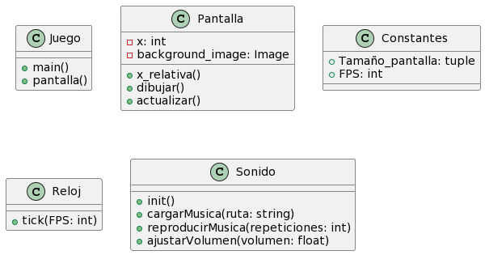

Descripción general
====

Este código crea un juego simple en Python usando la biblioteca PyGame. El juego tiene un fondo desplazable y reproduce música de fondo.

### Funciones:
- __*pantalla():*__ Esta función dibuja el fondo desplazable y actualiza la pantalla.
.
- __*x_relativa:*__ Calcula la posición relativa del fondo para el desplazamiento continuo.
.
- __*main():*__ La función principal del juego que inicializa PyGame, carga recursos y ejecuta el bucle principal del juego.

### Variables:
- __*Screen:*__ La superficie principal de PyGame donde se dibuja el juego.
- __*FPS:*__ La velocidad de fotogramas del juego.
- __*X:*__ La posición horizontal del fondo.
- __*RELOJ:*__ Un objeto pygame.time.Clock para controlar la velocidad del juego.
- __*background_image:*__  La imagen del fondo.
- __*tamaño_pantall:*__ La tupla que define el tamaño de la pantalla.

### Diagrama:
